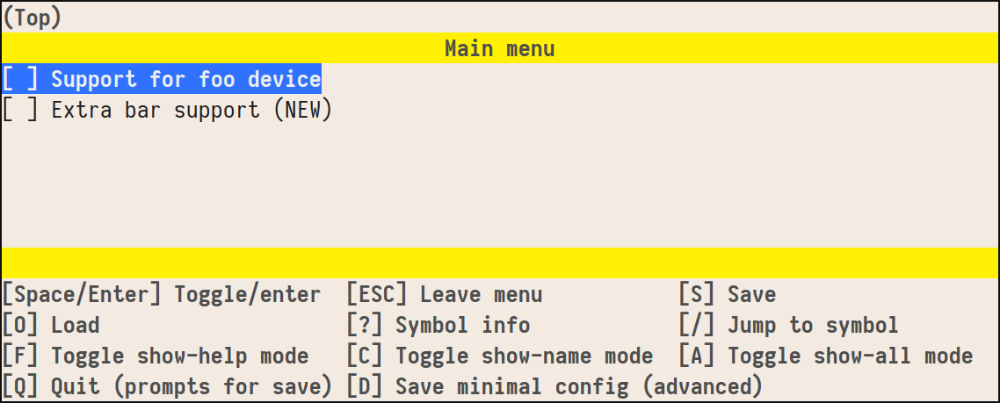
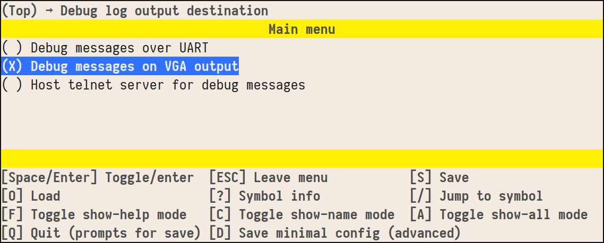
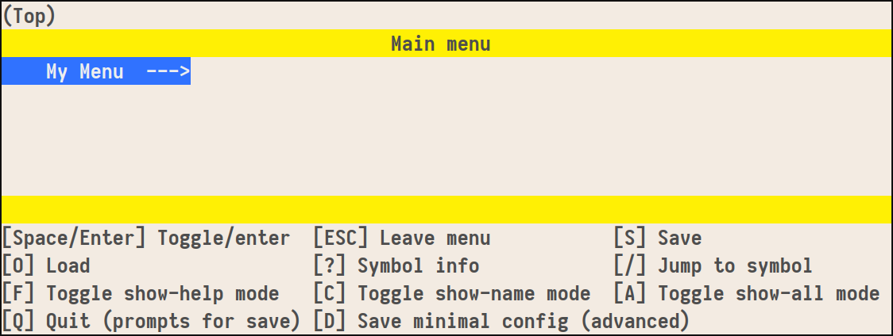

Kconfig
=======

:Author: Jack Rosenthal
:Date: 2021-02-04

What is a configuration language?
---------------------------------

**Configuration + Schema = Validated & Full Configuration**

* Schema defines...

  - What makes a valid configuration.

    - Dependencies.

  - Defaults.

* Configuration defines the specific set of values that should be
  applied for a certain application.

* Full configuration

  - Like the original configuration, but often includes the
    implications of default values.

  - Generally intended for machines to read instead of humans (e.g.,
    binary format).

Kconfig
-------

* Configuration language

* Originally made for the Linux kernel, but now used in dozens of
  other projects.

  - Most popular with C and C++, but no reason it cannot be used with
    other languages.

  - Generally used for "compile time configuration", but easily could
    be used for a runtime configuration system as well.

Multiple implementations
------------------------

* ``kconfig``

  - Implemented in 30,000+ lines of C
  - Can be found at ``scripts/kconfig`` in a kernel source tree
  - Sketchy & ugly code IMHO

* ``kconfiglib``

  - Python library in single file with no dependencies
  - Has a couple of nice language extensions
  - https://github.com/ufalizer/kconfiglib

.. admonition:: Follow the examples

   If you want to follow along with examples, install ``kconfiglib``
   on your system::

     $ pip3 install --user kconfiglib

Who uses Kconfig?
-----------------

* The Linux kernel
* Busybox
* Toybox
* Zephyr OS
* Coreboot
* U-Boot
* Buildroot
* uClibc
* ...
* Your project?

The Schema
----------

A Kconfig schema consists of a set of symbols defined like so:

.. sourcecode:: kconfig
   :file: examples/a/Kconfig

This defines two boolean symbols, ``FOO`` and ``BAR``. They can take
the values ``y`` or ``n``.

The Configuration
-----------------

A Kconfig configuration (for the previously defined schema) might look
like so:

.. sourcecode:: kconfig
   :file: examples/a/.config

Note that in this case ``BAR`` gets set to ``n`` as we didn't give it
a value.

Validating and completing our config
------------------------------------

Assume our schema is saved as ``Kconfig``, and our input configuration
is saved as ``.config`` (these are conventional names).  Run this
command to validate and complete the configuration::

  $ KCONFIG_CONFIG=.config genconfig \
                             --config-out config.out \
                             --header-path config.h

Looking at ``config.out``:

.. sourcecode:: kconfig
   :file: examples/a/config.out

And ``config.h``:

.. sourcecode:: c
   :file: examples/a/config.h

menuconfig
----------

While configuration files can be edited by hand, Kconfig provides a
terminal based UI for editing the configuration called ``menuconfig``:

Most users prefer ``menuconfig`` to hand editing the configuration in
a text editor.

Kconfig types
-------------

The types in Kconfig are:

- ``bool``: Accepts ``y`` or ``n``
- ``tristate``: Accepts ``y``, ``n``, or ``m`` (Linux-kernel specific)
- ``string``: String values
- ``int``: Integer values
- ``hex``: Like ``int``, but assumes hexadecimal input even if you
  forgot to type ``0x`` in front

Notice there's nothing complex like lists or anything. This is
intentional and by design.

Default values
--------------

Default values can be specified using ``default``.

.. sourcecode:: kconfig

   config PRINTER
           bool "Printer support"
           default y

You can use ``default ... if`` to make the default depend on other
configuration values:

.. sourcecode:: kconfig

   config OUTPUT_FILE
           string "Default output file"
           default "/dev/lp0" if PRINTER
           default "/dev/null"

The prompt
----------

After the name of the type, you can write a prompt string.  This is
what shows as the short text in ``menuconfig``:

.. sourcecode:: kconfig

   config DEBUG_SHELL
           bool "UART debug shell"

If you omit the prompt string, it will be hidden from the menus.  This
is useful for internal derived symbols you don't want to expose to the
user.

.. sourcecode:: kconfig

   config FPU_COMPILER_FLAG
           string
           default "-mfloat-abi=hard" if HARDWARE_FPU
           default "-mfloat-abi=soft"

Dependencies
------------

Using ``depends on``, you can make certain options only available if
their dependency is.

.. sourcecode:: kconfig

   # FOO depends on BAR if BAZ is enabled
   config FOO
           bool "Foo support"
           depends on !BAZ || (BAZ && BAR)

Dependencies with ``if``
------------------------

``if`` can be used to bulk-apply a dependency to many symbols:

.. sourcecode:: kconfig

   config UART
           bool "UART console"

   if UART

   config UART_DEBUG_SHELL
           bool "Debug shell on UART"

   config UART_VERBOSE_LOG
           bool "Extra verbose log messages on UART"

   endif  # UART

This would be the same as writing ``depends on UART`` for both
``UART_DEBUG_SHELL`` and ``UART_VERBOSE_LOG``.

Reverse dependencies
--------------------

``select`` forces a boolean symbol to have the symbol ``y`` if a
config option is enabled:

.. sourcecode:: kconfig

   config A
           bool "A feature"

   config B
           bool "Another feature"
           select A

In this case, ``A`` would be forced to take the value ``y`` (even if
it had previously been assigned ``n``) if ``B`` is enabled.

.. warning::

   ``select`` can be rather confusing for users.  The Linux Kernel
   Style Guide advises only using it on invisible symbols.

Implications (reverse defaults)
-------------------------------

While ``select`` can be dangerous, it's safer brother ``imply`` can be
useful syntactic sugar for reverse defaults.

.. sourcecode:: kconfig

   config A
           bool "A feature"

   config B
           bool "Another feature"
           imply A

In this case, it would be equivalent to writing ``default y if B`` on
``A``.

Choice Symbols
--------------

When boolean symbols are grouped together in a choice, only one (and
exactly one) may be enabled at a time.

.. sourcecode:: kconfig
   :file: examples/choice/Kconfig

For choice symbols, the first one is always ``default y``.

Choice UI in menuconfig
-----------------------

Menus
-----

The schema itself allows configuration options to be conceptually
organized as nested menus.

.. sourcecode:: kconfig
   :file: examples/menu1/Kconfig

Menus
-----

.. image:: examples/menu1/2nd.png
   :width: 100%

Menus for subsystems
--------------------

A common pattern is to make a config option to enable a subsystem, and
enable the menu only if the option is available. Like this:

.. sourcecode:: kconfig

   config ETHERNET
           bool "Ethernet driver support"

   if ETHERNET

   menu "Ethernet driver options"

   # ... options

   endmenu

   endif # ETHERNET

Menus for subsystems
--------------------

.. sourcecode:: kconfig

   menuconfig ETHERNET
           bool "Ethernet driver support"

   if ETHERNET

   # ... options

   endif # ETHERNET

Menus for subsystems
--------------------

Multiple files
--------------

Configs can grow too large for one file:

* ``source`` - source a file by path relative to where ``genconfig``
  was started

Kconfiglib extensions:

* ``rsource`` - source a file by relative path to this ``Kconfig``
  file
* ``osource`` - optionally source a file by relative path to where
  ``genconfig`` was started
* ``orsource`` - optionally source a file by relative path to this
  ``Kconfig`` file

Integrating Kconfiglib & Makefiles
----------------------------------

Kconfiglib works well with pretty much any build system that allows
you to execute external commands along the way.

Here's how to use it with a Makefile.

Starter Makefile
----------------

.. sourcecode:: make
   :file: examples/Makefile1/Makefile

Adding genconfig
----------------

.. sourcecode:: make
   :file: examples/Makefile2/Makefile

Adding easy menu rules
----------------------

.. sourcecode:: make
   :file: examples/MakefileRules/Makefile

Conditionally compiling sources
-------------------------------

Lots of Kconfig + Makefile systems use this neat trick to
conditionally compile source files:

.. sourcecode:: make

   srcs-y += main.c
   srcs-$(CONFIG_FOO) += foo.c
   srcs-$(CONFIG_BAR) += bar.c

   objfiles := $(patsubst %.c,$(OUTDIR)/%.o,$(srcs-y))

Other Build System Recommendations
----------------------------------

* Copying ``kconfiglib.py``, ``genconfig.py``, and ``menuconfig.py``
  into a directory like ``3rdparty/kconfiglib`` is common practice.
  Since there are no dependencies but Python 3.4+, this makes it easy
  for your users to get a build up and going.

  - Git submodule is an alternative.

* There's some nice macros in the Linux kernel that can cut down on
  the ``#ifdefs``.  Check out ``IS_ENABLED``.

Complete Build System Example
-----------------------------

Check out ``https://git.sr.ht/~jmr/kconfig-example``.  There is a
complete ``Makefile`` C codebase example in there.

Kconfig downfalls?
------------------

* Kconfig is designed to fit nicely into ``#defines`` for a C codebase.
  By this design, lists aren't supported.

* Circular dependencies are disallowed.  This is because Kconfig is
  designed to be configured in a user interface, where expressing a
  circular dependency relationship to the user would be confusing.

Linux Kernel: Kconfig vs. Device Tree
-------------------------------------

In the Linux Kernel, it may seem as if there are two configuration
systems: Kconfig and Device Tree.

The general principle is:

- Device tree configures the layout of the **hardware**.  It expresses
  the various devices available on a mainboard, not which software
  features or drivers are available.

- Device tree is rarely "user-configurable".  The user usually picks
  the appropriate device tree for their board and makes no
  customizations.

Cool things to do with Kconfig
------------------------------

- Dotfiles (per-computer configuration)
- Taxes?
